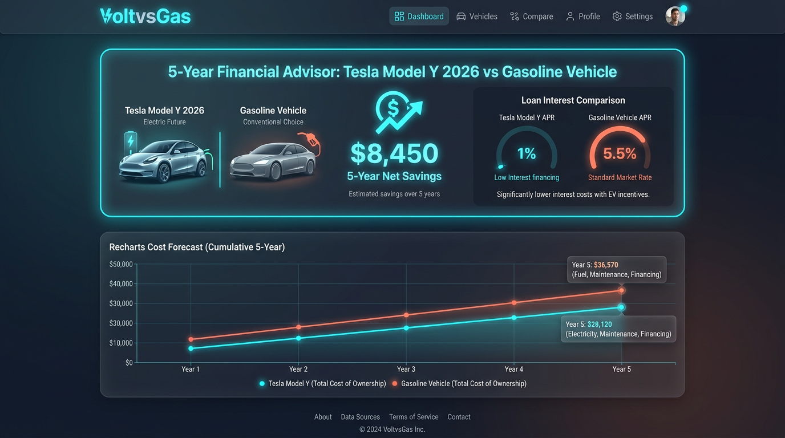
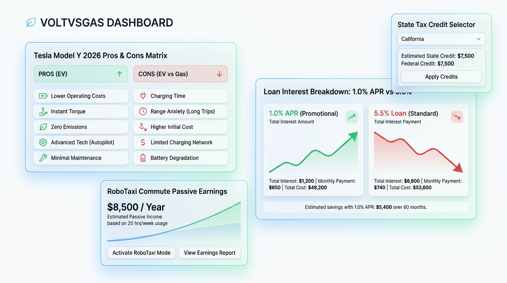

# ⚡ VoltvsGas Advisor — Tesla Model Y 2026 & EV vs. Gas Decision Engine

An interactive, real-time 5-year Total Cost of Ownership (TCO) calculator and financial decision engine designed to help users evaluate switching between gasoline vehicles and the **Tesla Model Y 2026 ("Juniper" Refresh)**.


*Dark Mode Dashboard with real-time 5-year cost forecast and 1% APR interest savings*


*Light Mode Dashboard with Pros & Cons Comparison Matrix, State Credits, and RoboTaxi Earnings Engine*

---

## ✨ Key Features

- **🏎️ Tesla Model Y 2026 Specs**:
  - Pre-configured 2026 "Juniper" trims: **RWD ($44,990)**, **Long Range AWD ($48,990)**, and **Performance AWD ($57,490)**.
- **🏛️ Nationwide State EV Tax Credits Database**:
  - Live incentive calculator for **Colorado ($5,000)**, **New Jersey ($4,000)**, **Illinois ($4,000)**, **Connecticut ($4,250)**, **Massachusetts ($3,500)**, **Washington (~$3,800 tax exemption)**, **California ($2,000–$7,500)**, **New York ($2,000)**, and custom state credits.
- **💳 60-Month Financing APR Comparison Engine**:
  - Compares Tesla's **1.0% Promotional APR** vs standard **5.5% Gas Auto Loans**, calculating exact interest paid over 5 years.
- **⚡ Time-of-Use (TOU) & Free Utility Rate Plans**:
  - Supports **Free Weekends (Fri 6p–Sun 11:59p)** and **Night Owl (6p–6a)** plans, driving effective eGallon costs down to **~$0.30/gal equivalent**.
- **🤖 RoboTaxi / Idle Commute Monetization**:
  - Calculates passive ride-sharing revenue generated during office commute idle hours (**9:30 AM – 4:30 PM**), generating ~$475+/month.
- **📱 FSD & Insurance Adjustments**:
  - Factored **Full Self-Driving ($99/mo)** software subscriptions and differential auto insurance rates.
- **📊 Tabular Pros & Cons Matrix & Final Verdict**:
  - Automated decision recommendation synthesizing 5-year net ROI, interest savings, maintenance, and environmental impact.
- **☀️ Light / Dark Theme Switcher**:
  - Seamless single-click theme switching for optimal day or night viewing.

---

## 🚀 Quick Start / Installation & Execution

### Prerequisites

- **Node.js**: v18.0.0 or higher
- **npm**: v9.0.0 or higher

### 1. Clone the Repository

```bash
git clone https://github.com/<YOUR_GITHUB_USERNAME>/<YOUR_REPO_NAME>.git
cd ev-vs-gas-advisor
```

### 2. Install Dependencies

```bash
npm install
```

### 3. Run Development Server

```bash
npm run dev
```

Open your browser and navigate to **`http://localhost:3000`** (or the port specified in terminal output).

---

## 📦 Production Build & Deployment

To create an optimized production build:

```bash
npm run build
```

To preview the production build locally:

```bash
npm run preview
```

---

## 🛠️ Technology Stack

- **Core**: React 18, TypeScript, Vite
- **Styling**: Vanilla CSS tokens with Glassmorphism, Tailwind CSS
- **Charts & Data**: Recharts, Canvas Confetti
- **Icons**: Lucide React

---

## 📄 License

MIT License — feel free to customize and deploy!
